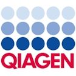

The meeting will run from: 
     **8am Tuesday July 29th through mid afternoon on Thursday July 31st, 2025.**

     **There will be an additional day for hands on workshops on Friday 1st Aug 2025**

## Outline Schedule 

* **Monday, July 28th GSC board meeting** - Invite only. Venue TBC
    * 1:00-4:00 pm: Board Meeting; 5:30 pm: Board Dinner

* **Tuesday, July 29th GSC main meeting** (**8:45 am - 5:00 pm**) 
  * [Keynote](https://genomicsstandardsconsortium.github.io/GSC25-Cambridge/pages/keynotes/) 1: Ewan Birney
  * Session 1: 30yrs of Genomes, 20 yrs of Genomic standards 
  * Session 2: GSC partnerships 
  * Evening: Welcome reception & BBQ
  
* **Wednesday, July 30th GSC main meeting** 
  * [Keynote](https://genomicsstandardsconsortium.github.io/GSC25-Cambridge/pages/keynotes/) 2: Thulani Makhalanyane
  * Session 3: GSC Standards (MIxS v7.0 & beyond)
  * Session 4: Biodiversity & environmental genomics 

* **Thursday, July 31st GSC main meeting**
  * [Keynote](https://genomicsstandardsconsortium.github.io/GSC25-Cambridge/pages/keynotes/) 3: Lara Urban
  * Session 5: Future of Genomics and Standards 
  * Session 6: Inovations in Genomics and Standards 

* **Friday, August 1st GSC Working group meetings**
  * details coming soon  
  
  [Click here to access the agenda document](https://docs.google.com/document/d/1uxYI9YDxS6jvpFBBGmeSBeIbnpTo14W2lWtnmqLonOI/edit?usp=sharing)

## Agenda

## Thank you to our sponsors

		 				 	 	

