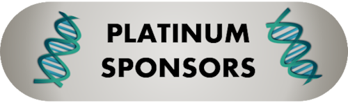
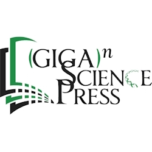
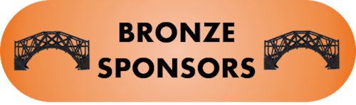

 

___

 

___

  

___

 

___

# Sponsorship opportunities

This meeting is intended for academic, corporate, and government professionals in the fields of medical genomics, environmental genomics, metagenomics, and microbiome sciences, tackling technical, metadata, and reproducibility challenges related to sample collection, processing, and genomic sequencing workflows critical for small- and large-scale datasets. It is our intention to discuss and plan for evolving genomic and laboratory standards to address the needs of clinical, academic, and industry researchers with a focus on precision medicine and agriculture. 
Attendance for the annual meeting is expected to be between 80-120 participants. We envisage a total of between 10 and 20 sponsors of all levels, with 5 to 8 of those at the Platinum sponsor level. 
Scientific vendors will have the opportunity to interact with attendees and speakers during the entire meeting including the opening reception, daily coffee breaks, lunches, and in between sessions. This meeting allows for ample networking time between sponsors and attendees. 

# Sponsorship Level Opportunities:
A brochure describing the sponsorship opportunities is [available here](https://genomicsstandardsconsortium.github.io/GSC24-Tucson/assets/GSC24-Tucson_Sponsorship_v6.pdf).

## Bronze Sponsor ($1000) sponsors will receive the following benefits:
1.	Acknowledgment of your sponsorship on the GSC (www.gensc.org), including links to your company’s website.
2.	Inclusion of the sponsor’s logo in meeting materials.

## Silver Sponsor ($2,500) sponsors will receive the following benefits:
1.	Acknowledgment of your sponsorship on the GSC (www.gensc.org), including links to your company’s website.
2.	Inclusion of the sponsor’s logo in meeting materials.
3.	One free meeting registration.
4.	Organization name and logo recognition on meeting signage.
5.	Logo included on inter-session slides.
	
## Gold Sponsor ($4,500) sponsors will receive the following benefits:
1.	Acknowledgment of your sponsorship on the GSC (www.gensc.org), including links to your company’s website.
2.	Inclusion of the sponsor’s logo in meeting materials.
3.	One free meeting registration.
4.	Tabletop exhibition display (~1.6 m, 5ft).
5.	Half page advertisement in meeting literature.
6.	Organization name and logo recognition on meeting signage.
7.	Logo included on inter-session slides.

## Platinum Sponsor ($7500) sponsors will receive the following benefits:
1.	Guaranteed 15-minute speaking slot in the program of the annual GSC meeting.
2.	Acknowledgment of your sponsorship on the GSC (www.gensc.org), including links to your company’s website.
3.	Inclusion of the sponsor’s logo in meeting materials.
4.	Two free meeting registrations.
5.	Tabletop exhibition display (~1.6 m, 5ft).
6.	Organization name and logo recognition on meeting signage.
7.	Logo included on inter-session slides.
8.	Special recognition of Platinum sponsor at symposium and in print and marketing materials.
9.	Full-page symposium program advertisement.
10.	Sponsor representative to join GSC board for GSC24 board dinner.

## Custom Sponsorships
Custom sponsorships are available, such as add-ons, partial upgrades, and event sponsorships. Please let us know your needs by contacting the <a href="mailto:gsc24-tuscon-organisers@googlegroups.com?subject=GSC24 Tucson sponsorship">GSC24 organising committee</a> We are happy to accommodate!

