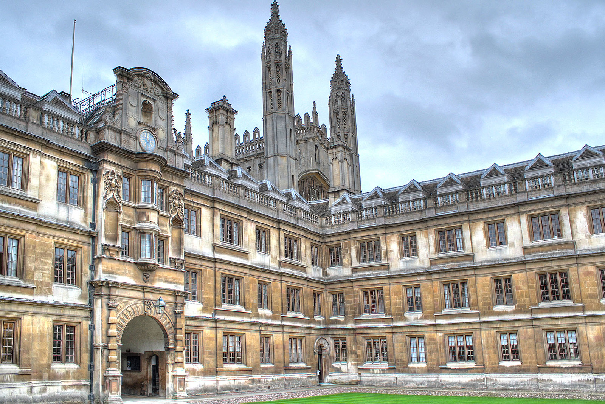
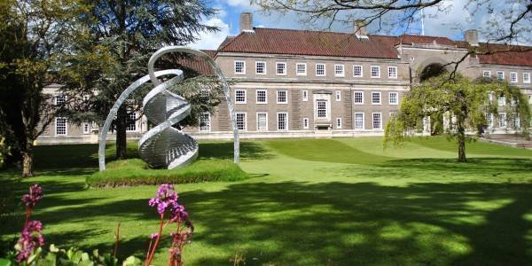
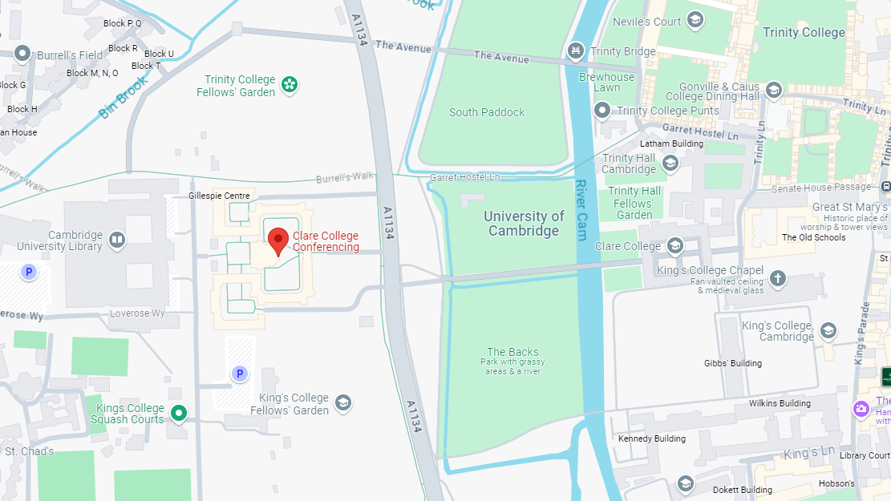

# Clare College, Cambridge University.

Clare College is a conference venue in the heart of Cambridge, offering a range of flexible meeting rooms,
dining space and accommodations. The second oldest College in Cambridge, Clare boasts 17th century
architecture, stunning gardens, and a convenient conference venue location in central Cambridge, either side
of the River Cam. The conference will be held in the Riley Auditorium.

17th Century Clare College

 Memorial Court, Clare College.

## Address
[Clare College Conferencing](https://www.clareconferencing.com/), Memorial Court, Queen's Rd, Cambridge, CB3 9AJ, United Kingdom

## Map location

[(](https://maps.app.goo.gl/PZgoxzvmjbZo3kAv9)

## Parking
Please note, there will be NO on-site parking available to delegates. The venue is within easy walking distance of the City centre, and there are multiple options for public transport, see the "Getting around Cambridge" section on the [Local Transportation page](https://genomicsstandardsconsortium.github.io/GSC25-Cambridge/pages/transport/)

## [About Genomic Standards Consortium](https://www.gensc.org/)

